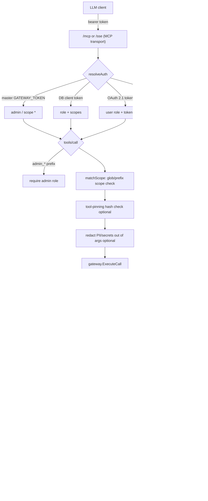

# Janus — MCP API Gateway: Technical Overview

> Audience: LSEG engineering
> Scope: what the system is, how it is built, the design choices and their rationale, the standards followed, and — in depth — how access is controlled (auth, RBAC, SSO, scopes).
> Source of truth: the Go codebase on `main` (`github.com/calitti/mcp-api-gateway`, deployed as **janus**). Line references are to files in this repo.

---

## 1. What this is

**Janus is a secure reverse proxy that turns configured REST/HTTP APIs into MCP tools that LLM clients can call.**

MCP (Model Context Protocol) is the emerging open standard for how an LLM client (Claude, Antigravity/Gemini, GitHub Copilot, Claude Desktop) discovers and invokes external "tools". Janus sits between those clients and your real backend APIs. An administrator registers a **connection** (a downstream API base URL + how to authenticate to it) and one or more **endpoints** (a specific path/method exposed as a named tool). The LLM then sees a clean list of tools like `lch_get_dpg_trade_volume` and can call them — while Janus enforces authentication, authorisation, egress policy, credential injection, redaction, and audit on every call.

The core value proposition for a regulated environment:

- **The LLM never sees downstream credentials.** Connections store only a *reference* to a secret in a vault (`auth_secret_ref`). The real API key/token is fetched server-side and injected into the outbound request. The model, and the model's operator, only ever see the tool result.
- **One controlled, audited chokepoint** for all LLM→API traffic, with RBAC, scope-limited tokens, SSRF protection, DLP redaction, and a full audit trail.
- **Config-driven, not code-driven.** New tools are added by registering a connection + endpoint (portal UI, REST API, admin CLI, or by importing an OpenAPI spec) — no redeploy.

It ships with an admin web portal (SPA), token/JWT auth, OIDC SSO, a pluggable credential vault, OpenTelemetry, and runs multi-replica on AWS EKS behind an nginx ingress.

---

## 2. Technology choices and why

| Choice | Rationale |
|---|---|
| **Go 1.26, single static binary** | One artifact runs both the server and the stdio MCP mode; trivial to containerise as a distroless, non-root image; strong stdlib HTTP/TLS/crypto so the security-critical paths lean on vetted code, not third-party frameworks. |
| **Minimal dependencies** | Only `golang-jwt/jwt/v5` (JWT), `google/uuid`, the SQL drivers, and OpenTelemetry. Auth, SSRF guarding, rate limiting, caching, and the vault cipher are built on the standard library (`crypto/*`, `net/http`, `net/netip`). Fewer supply-chain surfaces in a regulated deployment. |
| **Dual datastore: SQLite ↔ Postgres** | SQLite (CGO `go-sqlite3`) for single-node/dev with zero infra; Postgres (`DATABASE_URL=postgres://…`) for the multi-replica production deployment. The same query layer serves both — `db.query()` rewrites `?`→`$n` placeholders for Postgres; all queries are parameterised (no SQL injection). |
| **Pluggable vault via a `VaultProvider` interface** | Secret storage is a clean seam: `local` (AES-256-GCM encrypted file, single node), `postgres` (AES-256-GCM encrypted rows in the shared DB — correct for multi-replica), and `aws`/`gcp`/`azure` reserved. Unimplemented providers **fail closed** rather than return fake secrets. |
| **Stateless HTTP + in-cluster Postgres + HPA** | Pods hold no durable state, so the deployment autoscales 2→10 on load. Postgres is the single system of record. In-process short-TTL caches give per-pod speed without a hard Redis dependency. |
| **Two MCP transports on one binary** | The MCP ecosystem is mid-migration between the legacy HTTP+SSE transport and the newer stateless "Streamable HTTP" transport. Janus serves both so it works with Claude Code, Antigravity, and Copilot without per-client forks. |

---

## 3. How it is built — the big picture

Everything is wired in `main.go`. The startup sequence is deliberately ordered so the process **refuses to start** if it cannot be secure:

```
config.LoadConfig()        → fails closed if JWT_SECRET / GATEWAY_TOKEN weak or missing
  → storage.NewDB()        → SQLite or Postgres by URL scheme; short-TTL cache; pool tuning
  → vault.InitVault()      → local (AES-GCM file) | postgres (AES-GCM rows) | cloud=fail-closed
  → gateway.NewGatewayClient() → SSRF-guarded HTTP client + egress policy + secret/response caches
  → auth.NewAuthManager()  → JWT signer/verifier + constant-time gateway-token check
  → mcp.NewMCPServer()     → tool discovery/execution + sessions + async audit
  → portal.NewPortalServer() → admin REST API + OIDC SSO + embedded SPA
  → one http.ServeMux, wrapped with rateLimit(limitBody(mux))
```

The whole thing listens on a single port (`:8080`), with all four `http.Server` timeouts set, a 1 MiB body cap, a per-IP token-bucket rate limiter, graceful shutdown, and `/healthz` + `/readyz` (readiness pings the DB so the load balancer and HPA only route to pods that can actually serve).

### The two request surfaces

There are two entry surfaces sharing the same data layer, gateway client, and auth manager:

**A. The MCP path** (`pkg/mcp/server.go`) — what the LLM clients talk to.

**B. The Portal path** (`pkg/portal/api.go`) — what human administrators talk to.

### Request flow of a tool call



---

## 4. Access control — the heart of the system

This is where the design matters most for LSEG, so it is covered end to end. There are **two distinct identity planes**, each with its own credential type and its own authorisation model.

### 4.1 Plane 1 — MCP clients (the LLMs)

An MCP client authenticates with a **bearer token**. `resolveAuth` (`pkg/mcp/server.go:360`) maps that token to an `(identity, role, scopes)` triple by trying three sources in order:

1. **Master gateway token** — the `GATEWAY_TOKEN` env secret. A constant-time match (`crypto/subtle`) grants `identity=master`, `role=admin`, `scopes=["*"]`. This is the break-glass / bootstrap credential.
2. **Database client token** — a per-client bearer token created by an admin. Each carries its own `role` (e.g. `viewer`, `admin`) and a comma-separated **scope list**. Tokens are **hashed at rest (SHA-256)** and looked up by hash — the plaintext is shown exactly once at creation and is never recoverable. There is no seeded/default token: a well-known token would be a backdoor, so the seeder deliberately creates none (`main.go:689`).
3. **OAuth 2.1 access token** (opt-in, `OAUTH_ENABLED=true`) — a JWT validated against a trusted authorization server's JWKS with **audience binding (RFC 8707)**. These map to a non-admin `user` role and carry the token's own scopes.

**Authorisation on every tool call** happens in `handleRequest` (`server.go:604`):

- **Role gate:** any tool whose name starts with `admin_` is refused unless `role == "admin"` (`server.go:612`). Critically, an OAuth-authenticated caller is *always* `user` — it can **never** reach admin tools regardless of the scopes in its token. Admin is only ever granted by the master token or a client token explicitly provisioned with the admin role.
- **Scope gate:** `matchScope` (`server.go:276`) checks the tool name against the token's scopes. `*` matches everything; a trailing-wildcard scope (`lch_*`) matches by prefix; otherwise an exact match is required. Scopes filter both what a client can *see* (`tools/list`) and what it can *call*.

So a token can be scoped to, say, `lch_*` and role `viewer` — it will list and call only the LCH tools and can never touch admin management or another team's connections.

### 4.2 Plane 2 — Portal administrators (humans)

Admins authenticate to the portal and receive a **short-lived JWT** (HS256, 24 h, audience `mcp-portal`, issuer `mcp-api-gateway`). Two ways to obtain one:

- **Local login** (`POST /api/auth/login`) — enabled **only** when `ADMIN_PASSWORD` (≥12 chars) is configured; credentials are compared in constant time. Leave the password unset and local login is disabled entirely (SSO-only). There is no hardcoded/backdoor login.
- **SSO / OIDC** (see §5).

**Authorisation:** every administrative route (`/api/connections`, `/api/endpoints`, `/api/vault`, `/api/tokens`, `/api/logs`, `/api/settings`, OpenAPI import, etc.) is wrapped in `AdminAuthMiddleware` (`pkg/auth/auth.go:139`), which validates the JWT **and requires `role == "admin"`**. This is authorisation, not just authentication — a valid-but-non-admin token (e.g. an SSO user issued the default `viewer` role) is rejected with `403`. This closes the classic "authenticated ≠ authorised" gap.

### 4.3 JWT hardening

`ValidateJWT` (`auth.go:59`) pins the signing method to HS256 (`jwt.WithValidMethods`), blocking `alg=none` and RS↔HS confusion attacks, and enforces the expected audience and issuer. Secrets are never echoed back in error responses (no information disclosure).

### 4.4 Session anti-hijack (legacy SSE transport)

The legacy SSE transport opens a stream on `GET /sse`, then the client POSTs JSON-RPC to `/messages?sessionId=…`. Because the session ID travels in a URL, `ServeMessages` (`server.go:522`) **re-authenticates every POST**: it hashes the presented token and constant-time-compares it against the token hash captured when the session was created. Learning a session ID is not enough to drive tool calls — you must present the same token. The newer Streamable HTTP transport (`/mcp`) is fully stateless: every request is authenticated by its own bearer token, so any replica can serve it.

---

## 5. SSO / OIDC in depth

SSO is a standard **OpenID Connect Authorization Code flow**, implemented from first principles against the standard library and `golang-jwt` (no heavyweight OIDC framework). It is deliberately hardened — an earlier version that merely base64-decoded the ID token was rejected in review and replaced with full verification.

**Login (`GET /api/auth/sso/login`, `api.go:464`):**
1. Generates an unguessable `state` (32 random bytes) and stores it in a short-lived, `HttpOnly`, `SameSite=Lax` cookie (`Secure` when served over TLS) — **CSRF protection** for the login flow.
2. Redirects to the IdP's `/protocol/openid-connect/auth` with `client_id`, `redirect_uri` (built from `PUBLIC_BASE_URL` or the request host, always pointing back at Janus), `response_type=code`, `scope=openid profile email`, and the `state`.

**Callback (`GET /api/auth/sso/callback`, `api.go:494`):**
1. **Verifies `state`** against the cookie (constant-time) before doing anything else; mismatched/missing state is rejected.
2. **Exchanges the code** at the IdP token endpoint over a bounded-timeout HTTP client (a slow IdP cannot hang the request goroutine).
3. **Fully verifies the ID token** (`verifyIDToken`, `api.go:374`):
   - Fetches the issuer's **JWKS via OIDC discovery** (`/.well-known/openid-configuration` → `jwks_uri`), requiring HTTPS at both hops, and caches the RSA keys in-memory for 5 minutes (keeps verification off the network on the hot path).
   - **Pins the algorithm to RSA** (RS256/384/512) — `none` and HMAC are rejected — and selects the key by `kid`.
   - Validates **signature**, **`exp`** (expiration required), **`iss`** (must equal the configured issuer), **`aud`** (must contain our client ID), and **`nonce`** when one is requested.
4. Maps the verified `preferred_username`/`email` to a portal identity and mints a portal JWT with the role from **`OIDC_DEFAULT_ROLE`** (defaults to the least-privileged `viewer`).

**The least-privilege default is a deliberate safety choice.** An unset `OIDC_DEFAULT_ROLE` does **not** silently grant admin — it resolves to `viewer`, and if an operator sets it to `admin` the process logs a loud warning at startup. To grant a specific SSO user admin, they are provisioned explicitly; the general SSO population lands on `viewer` and is refused by `AdminAuthMiddleware`.

Interop note: the current authorization-request URLs use Keycloak's `/protocol/openid-connect/*` paths. For a different IdP (Entra ID, Okta, Ping) those paths come from the discovery document; wiring them through discovery is a small, well-isolated change.

---

## 6. Tool execution & egress security

When a tool is invoked, `gateway.ExecuteCall` (`pkg/gateway/client.go:198`) runs a fixed, defensive pipeline:

1. **Template rendering with escaping** — path placeholders (`{{id}}`) are substituted with **percent-escaped** values so a parameter cannot inject extra path segments (`../`, `/`) or alter the URL structure. GET params not consumed by the path become query args; body templates JSON-encode substituted values.
2. **SSRF guard (`validateEgress`, `client.go:152`)** — runs *before* any secret is fetched or request sent:
   - Only `http`/`https` schemes allowed.
   - **Hostname allowlist** enforced when `EGRESS_ALLOWLIST` is set (production should set it).
   - Resolves the host and **rejects private / loopback / link-local / unspecified addresses** — blocking the cloud metadata endpoint (`169.254.169.254`) and internal services.
3. **DNS-rebind protection** — the HTTP transport's custom `DialContext` re-validates the *actual* connected IP at dial time and dials the validated IP literal directly, closing the TOCTOU window a name-only pre-check would leave. Redirects are **not** auto-followed (a 3xx to an internal host would bypass the check).
4. **Credential injection from the vault** — only now is `auth_secret_ref` resolved and injected as `bearer`, `basic` (`user:pass`), or `custom_headers` (JSON map). The credential is attached to a request whose destination has already passed egress validation, so it cannot be exfiltrated to an attacker-chosen host.
5. **Bounded, jittered retries** for idempotent methods only (GET/HEAD/OPTIONS) on transport errors / 5xx, with exponential backoff and ±50% jitter (anti-thundering-herd). Non-idempotent methods run exactly once.
6. **Response body cap (10 MiB)** to prevent a malicious upstream from OOM-ing the gateway.

Optional **DLP redaction** (`REDACTION_ENABLED=true`) masks emails, Luhn-validated cards, JWTs, AWS keys, API keys and IBANs **out of the arguments before the call** (so a value lifted from the LLM's context can't be smuggled out) and **out of the result before it returns**. Redaction events are audited as *class + count only* — never the matched value.

Optional **tool-definition pinning** (`TOOL_PINNING_STRICT=true`) records a SHA-256 hash of each tool's definition; strict mode refuses to execute a tool whose definition changed since it was approved — a defence against "rug-pull" / tool-poisoning attacks. The hash and version are always surfaced in `tools/list` `_meta` so integrity-aware clients can detect drift themselves.

---

## 7. Secrets & the vault

- **No usable default secrets, fail-closed at startup.** `JWT_SECRET` and `GATEWAY_TOKEN` must each be ≥32 bytes or the process exits (`config.go:155`). `ADMIN_PASSWORD`, when set, must be ≥12 chars.
- **`local` vault** — a single file, **AES-256-GCM** encrypted at rest with a key derived (SHA-256) from `VAULT_ENCRYPTION_KEY` (falling back to `JWT_SECRET`). A legacy plaintext file is transparently migrated to ciphertext on first read, never losing secrets. Suitable for single-node/dev only (per-pod, not shared).
- **`postgres` vault** — AES-256-GCM encrypted secrets stored in the shared DB, correct for the multi-replica production deployment (all pods read the same encrypted store).
- **`aws`** — AWS Secrets Manager, one secret per downstream credential, namespaced by `AWS_SECRETS_PREFIX`. Authenticates via the pod's **IRSA** role (the SDK default credential chain — no static keys); Secrets Manager encrypts at rest with KMS and IAM scopes access to the vault namespace. `GetSecretValue` is the hot path; create/put/delete/list back the portal + CLI.
- **`gcp`/`azure`** — reserved; they **fail closed** (return an error) rather than injecting a placeholder string, so a misconfiguration is loud, not silently-broken auth.
- **Client tokens** are SHA-256 hashed at rest and looked up by hash; **downstream credentials** are stored only as vault references on connections; the master `GATEWAY_TOKEN` and DB secrets are supplied out-of-band (Kubernetes `Secret`), never committed.

---

## 8. Observability & operational safety

- **OpenTelemetry** tracing spans around tool execution, plus Prometheus metrics (tool call counts by status, duration histograms). `/metrics` is optionally bearer-token protected (`METRICS_TOKEN`).
- **Async audit log** — every `tools/call` is recorded (id, identity, tool, success/failure, duration, redaction summary) via a background worker, so the DB write never blocks the hot request path; if the buffer is full an entry is dropped-with-log rather than stalling the call.
- **Log hygiene** — the MCP transport logger redacts query-string values whose keys look like credentials (`token`, `session`, `secret`, `auth`, `key`, `password`) before anything reaches stdout/container logs.
- **DoS defences** — all four HTTP timeouts, 1 MiB body cap, per-IP token-bucket rate limiter (~50 req/s/IP, burst 100) with a background eviction sweeper bounding its memory, and correct client-IP derivation behind the ingress via `X-Forwarded-For`/`X-Real-IP`.
- **Graceful shutdown** drains in-flight requests on scale-in / rollout.

---

## 9. Scaling & deployment

Live posture (see `SCALING_AND_CACHING.md`): **stateless gateway pods on in-cluster Postgres, autoscaled by an HPA (2→10) with a PodDisruptionBudget.** In-process short-TTL caches (config 5 s, secret 30 s, response 10 s), all **busted on write**, so correctness is preserved (worst case ≤ TTL seconds of config staleness). DB connection pool sized so `DBMaxOpenConns × maxReplicas` stays under Postgres `max_connections`.

The one piece of shared state — legacy SSE sessions — is handled at the edge with **nginx cookie affinity** (a `route` cookie) so `/sse` and `/messages` land on the same pod; the stateless `/mcp` transport needs no affinity. Redis is a documented phase-2 lever (shared response cache, distributed rate limiter, cross-pod SSE registry) to add only when measured.

**CI/CD (`.github/workflows/deploy.yml`):** on push to `main`, build the image → push to ECR `…/janus` → `kubectl apply` to EKS cluster `sarc-aws` (eu-west-2, namespace `janus`). Auth is **GitHub OIDC** (short-lived, no long-lived AWS keys). Manifests are split by lifecycle: the pipeline applies only namespaced resources (the deploy role has namespace-scoped rights); the Namespace, the `mcp-gateway-secrets` Secret, Postgres, and the HPA/PDB are applied out-of-band so real secrets never live in git.

**Container:** distroless, non-root, static binary.

---

## 10. Standards & conventions followed

- **Protocol:** Model Context Protocol — both the legacy HTTP+SSE transport and the 2025 Streamable HTTP transport; JSON-RPC 2.0 message framing.
- **Auth standards:** OAuth 2.1 **resource server** semantics — RFC 9728 (protected-resource metadata + `WWW-Authenticate` challenge), RFC 8707 (resource-indicator / audience binding), RFC 7519 (JWT). OpenID Connect Authorization Code flow with discovery + JWKS for portal SSO. HS256 for portal sessions, RS256/384/512 verification for IdP ID tokens.
- **Transport security:** TLS 1.3 floor when terminating in-pod; optional mTLS (`RequireAndVerifyClientCert`); accurate reporting of edge-terminated TLS/mTLS so an ingress-terminated deployment isn't misreported as unencrypted.
- **Secure-by-default posture:** fail-closed config, least-privilege defaults, no default/backdoor credentials, constant-time secret comparison, parameterised SQL, hashed tokens at rest, encrypted secrets at rest, SSRF/DNS-rebind egress controls. The full audit trail is in `SECURITY_REVIEW.md`; the critical and high findings from that review are remediated in the code described here.
- **Engineering standards:** idiomatic Go, clean package boundaries (`auth`, `config`, `gateway`, `mcp`, `oauth`, `portal`, `storage`, `vault`, `telemetry`, `redaction`, `toolintegrity`), interface seams for the vault and store, unit tests, and `go vet` + `gofmt` as the lint gate (`just validate`).

---

## 11. What is possible today

**For administrators:**
- Register downstream API connections (base URL, auth type, vault secret reference, optional tool-name prefix for namespacing) via the **portal UI, REST API, admin CLI, or by importing an OpenAPI 3.x spec** (with a dry-run preview).
- Expose specific endpoints as named MCP tools with JSON-Schema parameter definitions and optional request-body templates.
- Manage vault secrets, issue and revoke **scoped, role-bearing client tokens** (shown once), and read the audit log — all from the portal.
- Get a consolidated **OpenAPI reference** of every exposed tool plus the admin API, and live per-connection health/latency stats.

**For LLM clients:**
- Connect over either MCP transport with a bearer token; discover only the tools their scope allows; call them and receive proxied, optionally-redacted results — never seeing downstream credentials.
- Run locally against Claude Desktop in **stdio mode** from the same binary.

**Security controls available to turn on:**
- OAuth 2.1 resource-server validation, strict tool-definition pinning, PII/secret DLP redaction, per-IP rate limiting, egress allowlisting, mTLS, and metrics-endpoint auth — each independently configurable, most off by default so they can be adopted incrementally.

**Deployment:** single binary, single port; scales statelessly 2→10 on EKS with Postgres; SQLite for a laptop; Docker Compose for a local cluster.

---

## 12. Honest limitations / roadmap

- **AWS Secrets Manager vault is implemented** (IRSA-authenticated, namespace-scoped IAM). **GCP/Azure remain fail-closed** — nothing deploys to those platforms yet; each is a contained addition behind the existing `VaultProvider` interface when their infrastructure exists. Production runs the encrypted Postgres vault today.
- **Portal SSO paths assume Keycloak-style endpoints** in the auth request; generalising fully to discovery-driven endpoints for arbitrary IdPs (Entra/Okta/Ping) is a small change.
- **Rate limiting and the response cache are per-pod**; true global limits / shared cache / cross-pod SSE registry are the documented Redis phase-2 work, to be added when load justifies it.
- **Portal JWTs are 24 h with no revocation list** — acceptable for an admin surface, but a refresh + revocation mechanism is a sensible hardening for a broad SSO rollout.

These are known and tracked, not surprises — the security review (`SECURITY_REVIEW.md`) and scaling plan (`SCALING_AND_CACHING.md`) document the full posture and the remediation history.
```